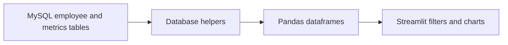

# Employee Performance Dashboard

A Streamlit dashboard for inspecting employee training, performance and safety metrics
from a MySQL database. It combines employee views, trends, comparisons and zone/status summaries.

## Data-to-view flow



The active application uses SQL-backed data; the older README's flat CSV description did not
match that path. Metrics include trainer grade, training count, UL/SL/PL, error count,
kaizen, flexibility, teamwork and additional safety/performance fields.

## Local setup

```bash
git clone https://github.com/DanushArun/employee-dashboard.git
cd employee-dashboard
python3 -m venv .venv
source .venv/bin/activate
python -m pip install -r requirements.txt
cp db_config.json.template db_config.json
streamlit run app.py
```

Edit `db_config.json` with your own MySQL connection, or set `DB_HOST`, `DB_NAME`, `DB_USER`
and `DB_PASSWORD`. Open the URL printed by Streamlit, normally `http://localhost:8501`.
A reachable, populated database is required; dependency installation alone provides no employee
data.

## Expected schema

[src/utils/create_tables.sql](src/utils/create_tables.sql) defines `employee_core_data` and
`performance_metrics`, linked by employee ID. Metrics are recorded against a `month` field.
Review this schema and [update_schema.sql](src/utils/update_schema.sql) against your own test
schema before executing SQL or migration helpers. This documentation update did not alter a
database.

## Source map

- [app.py](app.py): dashboard layout, filtering and grade calculations.
- [database.py](src/utils/database.py): configuration and SQL reads.
- [charts.py](src/components/charts.py): chart construction.
- [DEPLOYMENT_GUIDE.md](DEPLOYMENT_GUIDE.md): recorded deployment instructions.

## Verification and boundaries

Source, schema and dependency paths were reviewed. No live employee database query,
cloud deployment or browser acceptance run was performed for this README update.
There is no committed automated test suite or measured accuracy benchmark.
Displayed scores depend on the input data and implemented criteria; they are not an independently
validated employee assessment. Use synthetic records when checking the dashboard outside an
authorized employee-data environment.
