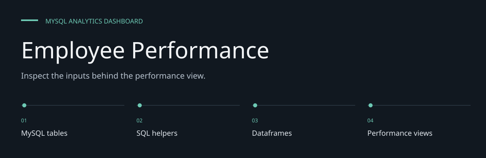
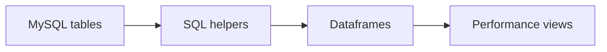
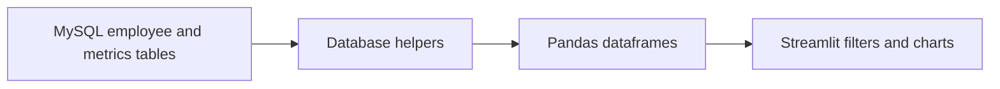

# Employee Performance

**Inspect the inputs behind the performance view.**

A Streamlit dashboard for inspecting employee training, performance and safety metrics
from a MySQL database. It combines employee views, trends, comparisons and zone/status summaries.


[Architecture](docs/ARCHITECTURE.md) · [Evaluation guide](docs/EVALUATION.md)

**Contents:** [The challenge](#the-challenge) · [Walkthrough](#walk-through-the-project) ·
[Implementation](#implementation-state) · [Design choices](#engineering-choices) ·
[Next evidence](#next-evidence-to-collect)

---

## The challenge

Employee metrics become difficult to interpret when training, safety and production indicators sit
in separate records. This dashboard joins configured SQL-backed records into employee, trend,
comparison and zone views, while leaving the scoring criteria in source.

## System at a glance



## Walk through the project

### 1. Prepare authorized data

Review the core/metrics schema and use a synthetic test database. The application does not
manufacture data when a database is missing.

### 2. Select an employee

Inspect the employee record and selected period. Database helpers produce the dataframes consumed
by the dashboard.

### 3. Compare the indicators

Review training, performance, safety and teamwork metrics and their grading criteria. Comparisons
are product calculations, not independent employment judgments.

### 4. Trace a chart

Follow the displayed result back to its SQL query and input record. Validate missing data and
normalization before interpreting differences.

## Data-to-view flow



The active application uses SQL-backed data; the older README's flat CSV description did not
match that path. Metrics include trainer grade, training count, UL/SL/PL, error count,
kaizen, flexibility, teamwork and additional safety/performance fields.

## Local setup

```bash
git clone https://github.com/DanushArun/employee-dashboard.git
cd employee-dashboard
python3 -m venv .venv
source .venv/bin/activate
python -m pip install -r requirements.txt
cp db_config.json.template db_config.json
streamlit run app.py
```

Edit `db_config.json` with your own MySQL connection, or set `DB_HOST`, `DB_NAME`, `DB_USER`
and `DB_PASSWORD`. Open the URL printed by Streamlit, normally `http://localhost:8501`.
A reachable, populated database is required; dependency installation alone provides no employee
data.

## Expected schema

[src/utils/create_tables.sql](src/utils/create_tables.sql) defines `employee_core_data` and
`performance_metrics`, linked by employee ID. Metrics are recorded against a `month` field.
Review this schema and [update_schema.sql](src/utils/update_schema.sql) against your own test
schema before executing SQL or migration helpers. This documentation update did not alter a
database.

## Source map

- [app.py](app.py): dashboard layout, filtering and grade calculations.
- [database.py](src/utils/database.py): configuration and SQL reads.
- [charts.py](src/components/charts.py): chart construction.
- [DEPLOYMENT_GUIDE.md](DEPLOYMENT_GUIDE.md): recorded deployment instructions.

## Verification and boundaries

Source, schema and dependency paths were reviewed. No live employee database query,
cloud deployment or browser acceptance run was performed for this README update.
There is no committed automated test suite or measured accuracy benchmark.
Displayed scores depend on the input data and implemented criteria; they are not an independently
validated employee assessment. Use synthetic records when checking the dashboard outside an
authorized employee-data environment.

## Engineering choices

**SQL is the active data path.** The application queries MySQL rather than reading the old README
CSV schema.

**Input criteria are inspectable.** Grades and normalized chart values need review with their
underlying definitions.

**Database changes are separate.** Schema scripts are reviewed against a test schema before
execution.

## Implementation state

| State | Current evidence |
| --- | --- |
| Present | SQL-backed views, grade logic and charts |
| Present | Schema/migration helper source |
| Configuration required | Populated, authorized MySQL instance |
| Not validated | Assessment fairness, data accuracy or production access controls |

The [architecture guide](docs/ARCHITECTURE.md) maps these statements to source entry points.
The [evaluation guide](docs/EVALUATION.md) separates inspection, executable checks and
domain validation, with the next evidence needed for each project.

## Next evidence to collect

- Build a synthetic database acceptance fixture.
- Check chart calculations against known records.
- Review data access, missingness and scoring interpretation.
